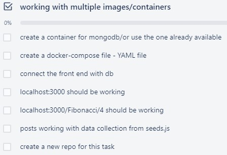
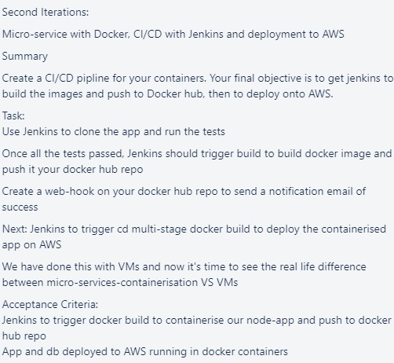

# Docker Task 1

<br>

## Task 1



- We can use the base image of mongodb as we don't really need to provision it

- We use `docker-compose` to run the following commands:
```yaml
version: "3.9"
services:
  nodejs:
    container_name: nodeapp
    build: ./app
    ports: 
      - "3000:3000"
    environment:
      - DB_HOST=database:27017
    depends_on:
      - database

  database:
    container_name: mongodb
    image: mongo
    ports: 
      - "27017:27017"
```

- This will create two containers, one with the app and the other with the database. After this, `/posts` will work but the database is not seeded. In such a case we will need to run `docker exec nodeapp node seeds/seed.js`
- To wrap these two commands in a single execution, we can make use of a shell script:
```shell
docker-compose up -d
docker exec nodeapp node seeds/seed.js
```

- Now if you navigate to your browser on `localhost:3000` you will see the app
    - Navigate to `localhost:3000/posts` to see the seeded posts

<br>

## Task 2 



- Since we are using Jenkins, we can pull the latest Jenkins image from DockerHub and run it in a container for use:
    - Run `docker pull jenkins/jenkins:lts`

<br>

---

### Used:
- [Jenkins and pushing to Docker Hub](https://medium.com/swlh/jenkins-pipeline-to-create-docker-image-and-push-to-docker-hub-721919512f2)